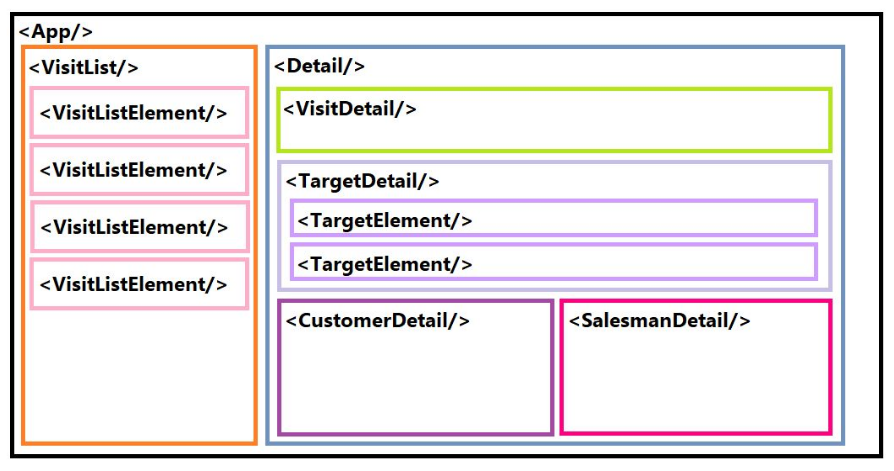

# React.js

El objetivo de esta práctica es realizar una versión simplificada del CRM de la asignatura (con el que el alumno ya está familiarizado), utilizando las tecnologías dadas en clase.

El alumno deberá componer una Single Page Application en ReactJS que muestre la lista de las visitas de un CRM y, al hacer click en cada una de ellas, que muestre la información completa para dicha visita.

## Preparación del entorno de desarrollo

Tradicionalmente los desarrollos de Frontend manejaban ficheros estáticos (HTML, CSS, JS...). En la actualidad, los desarrollos son cada vez más complejos; y a no son simples páginas que muestran información al usuario, sino que son webapps interactivas. Cada vez es más popular el uso de servidores de desarrollo (como Webpack) para esta clase de proyectos. Cuando el desarrollo se termina, se empaqueta y transforma la webapp en los ficheros HTML y JS a los que estamos acostumbrados.

Los servidores de desarrollo se pueden configurar al gusto de cada uno, pero lo más común es basarse en una configuración ya existente que permite empezar un proyecto de cero de forma fácil y rápica, lo que se conoce como **boilerplate**.

Para esta práctica vamos a utilizar un _boilerplate_ ya existente en este [enlace](https://github.com/sonsoleslp/react-iweb-boilerplate).

Para bajarse este boilerplate y comenzar un proyecto nuevo a partir de él, hay que seguir los siguientes pasos - alternativamente también puedes descargártelo como ZIP desde GitHub:

1. Instala node.js (6.11.x) y git sino lo has hecho ya.
2. Clona el proyecto boilerplate:
  `git clone https://github.com/sonsoleslp/react-iweb-boilerplate.git`
3. Borra el directorio `.git` oculto para desvincular el proyecto del repositorio del boilerplate.
4. Ejecuta el comando `npm install`. Se instalarán todas las dependencias del proyecto en una nueva carpeta `node_modules`.

Ahora que ya está listo el proyecto, el primer paso es ponerle nombre y autor. Para ello, es necesario modificar el _package.json_. En este fichero se encuentran además todas las dependencias del proyecto: Babel, React, Webpack... También en este fichero se definen los scripts npm para arrancar el servidor de desarrollo o realizar otras funcionalidades personalizadas.

A continuación se arrancará el servidor de desarrollo. Para ello hacemos `npm start` y abrimos el navegador en la URL `http://localhost:8080`. En esta URL podremos visualizar la aplicación en tiempo real mientras desarrollamos.

Si exploramos el directorio principal del proyecto, se comprueba que la mayoría son ficheros de configuración. 

El directorio más interesante es `app/components`, donde se deben crear todos los componentes React de la aplicación. En `app/assets` se situará el CSS de la aplicación y cualquier recurso adicional que queramos añadir.

Para entender mejor cómo funciona el servidor de desarrollo, observa el contenido de `index.html`. Se trata de la página web que renderizará nuestro servidor de desarrollo. Como ves, apenas tiene contenido; sólo tiene un elemento `div` con id `root` e importa un script llamado `bundle.js`. Si exploramos el fichero `webpack.config.js`, podemos comprobar que toma como entrada, entre otras cosas, el fichero `main.js` del directorio `app` y como salida genera un fichero `bundle.js`, es decir, el servidor webpack servirá el fichero `index.html` al que le pasará el script `bundle.js` generado a partir de `main.js`. El fichero `main.js` es el que sirve de puente entre React y el HTML de la página. En él, se rederiza el componente `App` (el componente principal de nuestra aplicación) en el elemento con `id="root"` de `index.html`, y dentro de él, todos los componentes que se definan.

## Comandos disponibles

* `npm start` - Arranca el servidor de desarrollo
* `npm clean` - Borra la carpeta dist
* `npm run production` - Empaqueta la aplicación en la carpeta `dist` lista para producción
* `npm run lint` - Comprueba la limpieza y formato del código
* `npm test` - Corre todos los tests
* `npm run test:watch` - Corre todos los tests en modo watch

## Comenzando a desarrollar

Antes de empezar a programar, uno debe pensar como estructurar la aplicación, y decidir _a grosso modo_ qué componentes va a necesitar y la jerarquía de los mismos. Un posible diseño es el siguiente:



El primer paso es importar los datos de las visitas a la aplicación. Se comenzará con datos estáticos de ejemplo, que almacenaremos en `app/assets/mock-data.js`. Para tener acceso a este fichero desde nuestra app, primero debemos importarlo. En la parte superior del fichero de nuestro componente ráiz (`App.jsx`), añadimos:

```javascript
import { visits } from './../assets/mock-data';
```

Ahora ya tenemos acceso a `visits` desde nuestra aplicación. Puedes probar a hacer `console.log(visits)`en el método `render()` de `App.jsx` y ver el resultado en la consola del navegador.

Recuerda que la estructura básica de un componente de React es la siguiente:

```javascript
import React from 'react';

export default class MyComponent extends React.Component {
  render() {
    return (
      <h1>Hello Wold!</h1>
    );
  }
}
```

## Para terminar

Una vez terminado el desarrollo, se puede empaquetar el código en ficheros estáticos. Para ello, en el terminal, hacemos `npm run production`. A este proceso se le llama "preparar para producción" (_build for production_). En el directorio `dist` se crearán todos los archivos necesarios para ejecutar la webapp. Puedes comprobarlo abriendo el `index.html` de la carpeta `dist` y viendo que todo funciona sin necesidad del servidor de desarrollo. Incluso si quisiéramos podríamos subirlo a un servidor de ficheros estáticos, como _neocities_ y nuestra webapp seguiría funcionando.

## Mejoras

Las mejoras añadidas a este proyecto son:

* Integración de Redux en todas las variables de estado, exceptuando las variables de estado del módulo Settings, que controlan la apertura y cierre de la ventana modal y son únicas de este módulo.
* Integración de React-Bootstrap.
* Implementación de marcar visitas como favoritas, así como desmarcarlas, utilizando los métodos POST y DELETE de la API del CRM.
* Filtros para organizar las visitas mostradas.
  * Además de poder poner las fechas en la URL, desde los filtros, se puede filtrar por periodos de tiempo, gracias a un DataPicker, de la API de Airbnb.
  * Filtrar por nombre de Salesman.
  * Filtrar por nombre de Customer.
  * Mostrar favoritas.
  * Todos estos filtros se pueden combinar, para estrechar la búsqueda lo máximo posible. Haciendo click en Reset, se resetean todos los filtros de búsqueda, exceptuando el de las visitas favoritas, que se queda en el último estado.
* Barra de búsqueda que filtra resultados en función de la información de Customers y Salesmen (nombre, id, correo, dirección, número de teléfono...). La busqueda es inmediata, realizandose con cada pulsación de tecla, con una espera de 500mseg, para que puedas escribir todo seguido antes de que se realice la búsqueda.

## Autores

Esta práctica ha sido realizada por [Tasio Méndez Ayerbe](https://github.com/tasiomendez).
